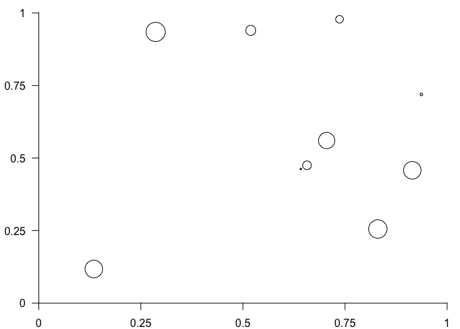

<!-- README.md is generated from README.Rmd. Please edit that file -->

# gtable <a href="https://gtable.r-lib.org"></a>

<!-- badges: start -->

[](https://github.com/r-lib/gtable/actions/workflows/R-CMD-check.yaml)
[](https://CRAN.R-project.org/package=gtable)
[](https://app.codecov.io/gh/r-lib/gtable)
[](https://lifecycle.r-lib.org/articles/stages.html#stable)
<!-- badges: end -->

gtable is a layout engine built on top of the grid package. It is used
to abstract away the creation of (potentially nested) grids of viewports
into which graphic objects can be placed. gtable makes it easy to ensure
alignment of graphic elements and piecemeal compositions of complex
graphics. gtable is the layout engine powering
[ggplot2](https://ggplot2.tidyverse.org) and is thus used extensively by
many plotting functions in R without being called directly.

## Installation

You can install the released version of gtable from
[CRAN](https://CRAN.R-project.org) with:

``` r
install.packages("gtable")
```

or use the remotes package to install the development version from
[GitHub](https://github.com/r-lib/gtable)

``` r
# install.packages("pak")
pak::pak("r-lib/gtable")
```

## Example

ggplot2 uses gtable for laying out plots, and it is possible to access
the gtable representation of a plot for inspection and modification:

``` r
library(gtable)
library(ggplot2)

p <- ggplot(mtcars, aes(mpg, disp)) + geom_point()

p_table <- ggplotGrob(p)

p_table
#> TableGrob (16 x 13) "layout": 22 grobs
#>     z         cells             name                                         grob
#> 1   0 ( 1-16, 1-13)       background               rect[plot.background..rect.38]
#> 2   5 ( 8- 8, 6- 6)           spacer                               zeroGrob[NULL]
#> 3   7 ( 9- 9, 6- 6)           axis-l           absoluteGrob[GRID.absoluteGrob.26]
#> 4   3 (10-10, 6- 6)           spacer                               zeroGrob[NULL]
#> 5   6 ( 8- 8, 7- 7)           axis-t                               zeroGrob[NULL]
#> 6   1 ( 9- 9, 7- 7)            panel                      gTree[panel-1.gTree.17]
#> 7   9 (10-10, 7- 7)           axis-b           absoluteGrob[GRID.absoluteGrob.22]
#> 8   4 ( 8- 8, 8- 8)           spacer                               zeroGrob[NULL]
#> 9   8 ( 9- 9, 8- 8)           axis-r                               zeroGrob[NULL]
#> 10  2 (10-10, 8- 8)           spacer                               zeroGrob[NULL]
#> 11 10 ( 7- 7, 7- 7)           xlab-t                               zeroGrob[NULL]
#> 12 11 (11-11, 7- 7)           xlab-b titleGrob[axis.title.x.bottom..titleGrob.30]
#> 13 12 ( 9- 9, 5- 5)           ylab-l   titleGrob[axis.title.y.left..titleGrob.33]
#> 14 13 ( 9- 9, 9- 9)           ylab-r                               zeroGrob[NULL]
#> 15 14 ( 9- 9,11-11)  guide-box-right                               zeroGrob[NULL]
#> 16 15 ( 9- 9, 3- 3)   guide-box-left                               zeroGrob[NULL]
#> 17 16 (13-13, 7- 7) guide-box-bottom                               zeroGrob[NULL]
#> 18 17 ( 5- 5, 7- 7)    guide-box-top                               zeroGrob[NULL]
#> 19 18 ( 9- 9, 7- 7) guide-box-inside                               zeroGrob[NULL]
#> 20 19 ( 4- 4, 7- 7)         subtitle         zeroGrob[plot.subtitle..zeroGrob.35]
#> 21 20 ( 3- 3, 7- 7)            title            zeroGrob[plot.title..zeroGrob.34]
#> 22 21 (14-14, 7- 7)          caption          zeroGrob[plot.caption..zeroGrob.36]
```

A gtable object is a collection of graphic elements along with their
placement in the grid and the dimensions of the grid itself. Graphic
elements can span multiple rows and columns in the grid and be gtables
themselves allowing for very complex automatically arranging layouts.

A gtable object is itself a grob, and can thus be drawn using standard
functions from the grid package:

``` r
library(grid)
grid.draw(p_table) # alternative use plot(p_table)
```


While most people will interact with gtable through ggplot2, it is
possible to build a plot from the ground up.

``` r
# Construct some graphical elements using grid
points <- pointsGrob(
  x = runif(10),
  y = runif(10),
  size = unit(runif(10), 'cm')
)
xaxis <- xaxisGrob(at = c(0, 0.25, 0.5, 0.75, 1))
yaxis <- yaxisGrob(at = c(0, 0.25, 0.5, 0.75, 1))

# Setup the gtable layout
plot <- gtable(
  widths = unit(c(1.5, 0, 1, 0.5), c('cm', 'cm', 'null', 'cm')),
  heights = unit(c(0.5, 1, 0, 1), c('cm', 'null', 'cm', 'cm'))
)

# Add the grobs
plot <- gtable_add_grob(
  plot,
  grobs = list(points, xaxis, yaxis),
  t = c(2, 3, 2),
  l = c(3, 3, 2),
  clip = 'off'
)

# Plot
grid.draw(plot)
```


